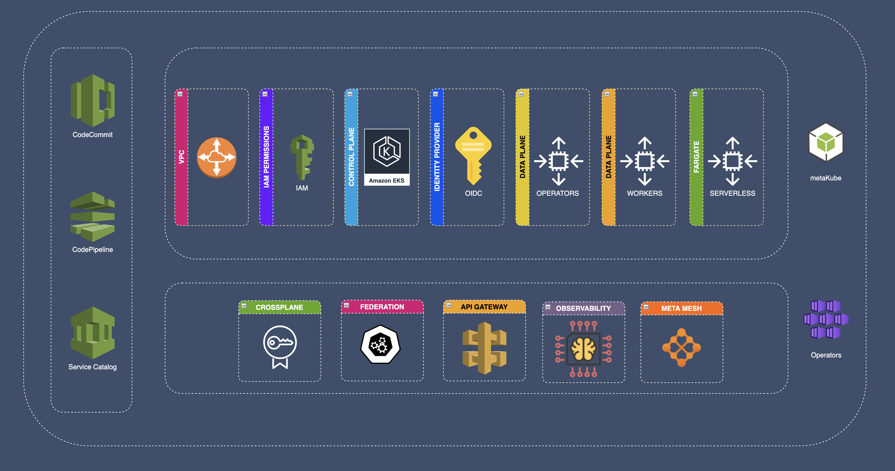

# Quick Start
META (from the Greek μετα-, meta-, meaning "after" or "beyond") is a prefix meaning more comprehensive or transcending.

Applied to Cloud micro-service orchestration, we observe that the number of ***managed Kubernetes*** clusters keeps increasing and it becomes harder and harder to have a full and high level overview over the global, security and management across the fleet of clusters.

Infrastructure code keeps increasing in complexity as more clusters are deployed with existing IaC tooling as Terraform and Cloudformation. IaC is not just about deploying the underlying infrastructure of the Kubernetes clusters but also the upper layers:  

  - VPC Deployment (Networking)
  - EKS Cluster and dependencies (EKS)
  - Kubernetes Operators and Provisioning  (Operators)
  - Application managed service dependencies (Application)

## metaDocs
metaDocs is a collection of multiple Kubernetes Controllers and Operators required by a metaKube framework.

